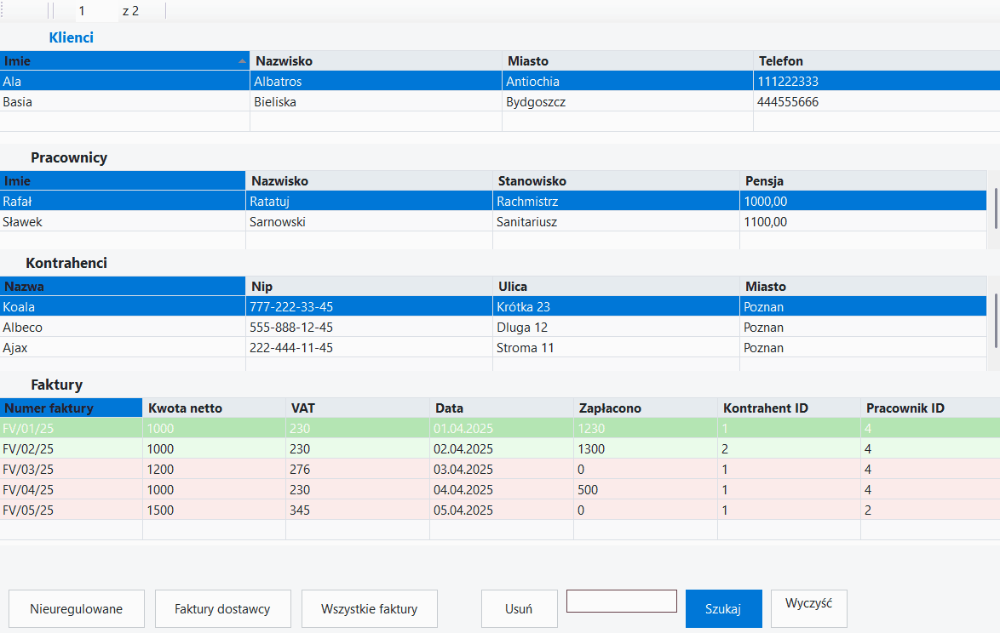

# Firma – WinForms Business Management App

Desktop application written in **C# (Windows Forms)** with **SQL Server LocalDB**, designed to manage core company data and sales processes.

---

## Demo

---

## Features

### Data Management
- manage **Clients**
- manage **Employees**
- manage **Contractors (Companies)**
- full CRUD operations (Create, Read, Update, Delete)

### Invoice System
- manage **Sales Invoices**
- assign invoices to:
  - contractor
  - employee
- automatic calculation logic (Net + VAT)

### Smart Filtering & Search
- filter **unpaid invoices**
- show invoices for selected contractor
- show all invoices
- global search across multiple tables

### UI & UX Enhancements
- color-coded invoices:
  - 🟢 paid
  - 🔴 unpaid
- clear section layout (Clients / Employees / Contractors / Invoices)
- responsive DataGridView layout
- intuitive navigation

### Data Persistence
- automatic saving to database
- data remains after application restart

---

## Business Logic

The application models a simplified company system:

- **Client** – individual customer  
- **Contractor** – company (with NIP, address)  
- **Employee** – responsible for handling invoices  
- **Invoice** – linked to contractor and employee  

Relationships:
- Invoice → Contractor (foreign key)
- Invoice → Employee (foreign key)

---

## Technologies

- C#
- .NET Framework 4.8
- Windows Forms
- SQL Server LocalDB
- ADO.NET (DataSet + TableAdapter)
- Visual Studio

---

## Database

The application uses a local SQL Server database file:

Firma.mdf

Configured with: |DataDirectory|
This ensures portability across different machines.

---

## Project Structure

- `Form1.cs` – main application logic
- `FirmaDataSet.xsd` – dataset and table adapters
- `App.config` – database connection configuration
- `Firma.mdf` – local database

---

## Status

✔ Fully functional CRUD application  
✔ Persistent LocalDB storage  
✔ Business logic implemented  
✔ UI enhanced with visual feedback  
✔ Ready for academic submission and portfolio  

---

## Purpose

The project demonstrates:
- understanding of **desktop application development**
- working with **relational data models**
- implementing **business logic in UI applications**
- building **user-friendly interfaces**

---

## Author

**Krystian Marciniak**
